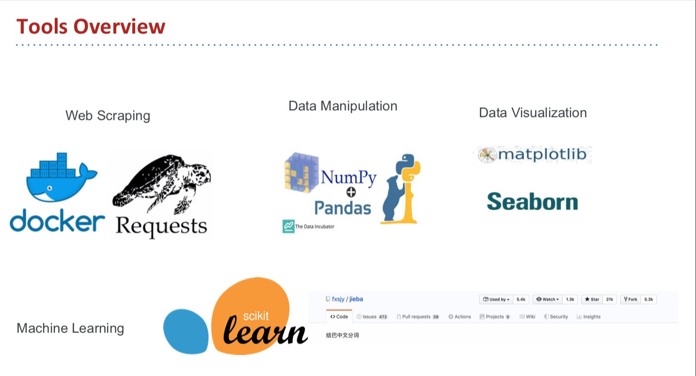
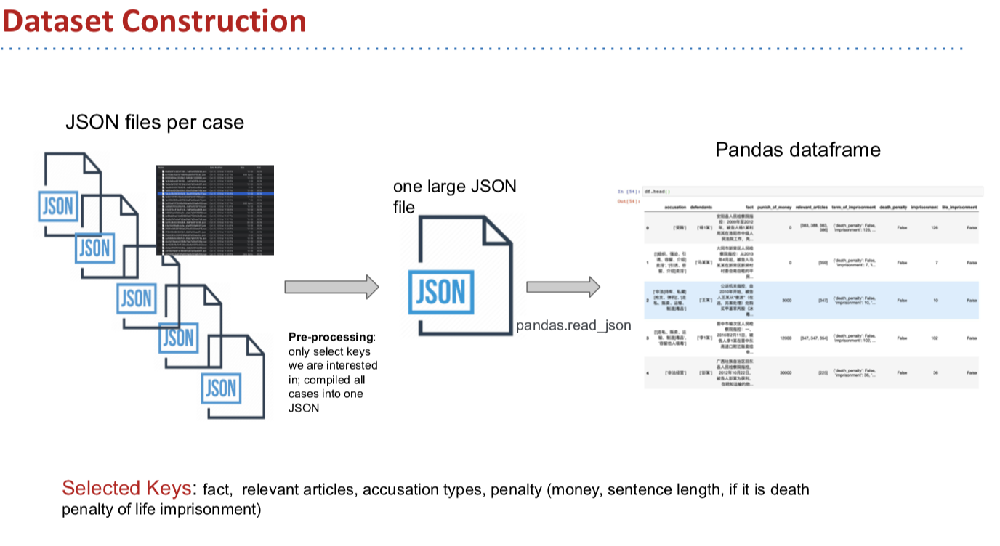
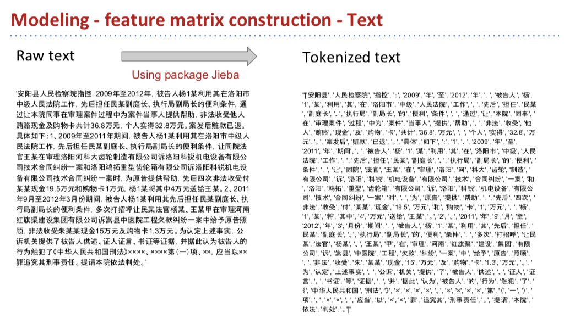
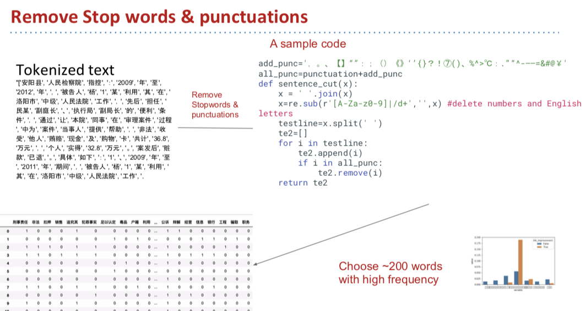
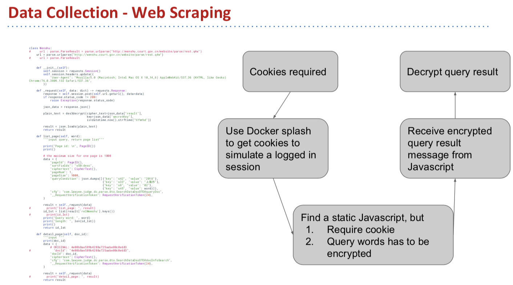
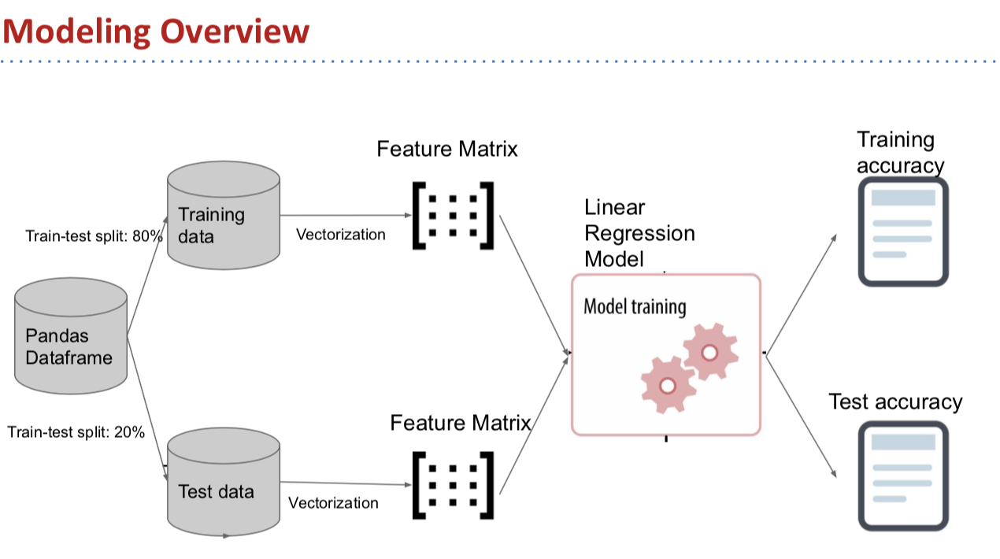
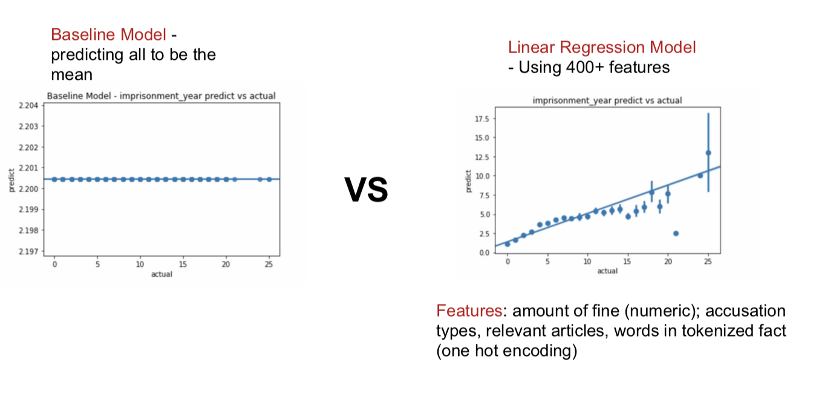

## Short Description

My project looks into featured correlated with sentence length by modeling chinese court documents web scraped from [wenshu.gov.cn](http://wenshu.court.gov.cn/). The following features are extracted for modeling: amount of fine, accusation types, relevant articles, keywords selected from case description.

## Dependencies

Python 3.7.1, Anaconda distribution.

## Files

### Data
Since GitHub does not support files larger than 100MB, the following are only subsets (generated from random sampling) of original data. Email violetyao@berkeley.edu for more!

1. `01-web-scraping-raw-data`: Contains ~ 20 sample raw json files (one case per json) web scraped from [wenshu.gov.cn](http://wenshu.court.gov.cn/). Those files are collected via 01-web-scraping.ipynb. ¶Note that as of 12/06, the code is no longer working due to a major upgrade against web scraping from wenshu.

2. `02-compiled-data-500.csv`: Contains 500 cases compiled and cleaned from 02-data-pre-processing.ipynb. It is a random sample from 150,000 cases fed to the model.

3. `03-tokenized-data-500.csv`: Contains 500 cases tokenized using package Jiaba from 02-data-pre-processing.ipynb. It is a random sample from 150,000 cases fed to the model.

4. `04-cleaned-data-500.csv`: Contains 500 cases with stopwords and other stuffs removed from 02-pre-processing.ipynb. It is a random sample from 150,000 cases fed to the model.

 

### Code

1. `01-web-scraping.ipynb`: Web scraped data from [wenshu.gov.cn](http://wenshu.court.gov.cn/) and exports raw json files into directory `01-web-scraping-raw-data` The basic design is to query keywords to get document id, then download json files using document id.

2. `02-data-pre-processing.ipynb`: Load and compile json files, melt several columns and save as `02-compiled-data.csv`. Tokenize `fact` column using package Jiaba, save as `03-tokenized-data.csv`. Remove stopwords and other stuffs, save as `04-cleaned-data.csv`. Note GitHub versions of those data csvs are `02-compiled-500.csv`, `03-tokenized-data-500.csv`, `04-cleaned-data-500.csv`.

3. `03-modeling.ipynb`: Conduct descriptive analysis of the data and filter out cases with dealth_penalty and life_imprisonment. Trained a Linear Regression using accusation types, relevant articles, and keywords selected from case description.

### Results

1. `model_result.png`: Visualization of model's prediction of sentence length to actual

2. `final-presentation.pdf`: Slides for final presentation. Detailed data collection, dataset construction, analysis, modeling and tools overviews can be found at the slides.

## More Information

Contact: violetyao@berkeley.edu

Tons of thanks for developers on GitHub, stackoverflow, and CSDN who also work on wenshu website. Web scraping part of the project has been very challenging and my data collection cannot possibly be accomplished without their support.
